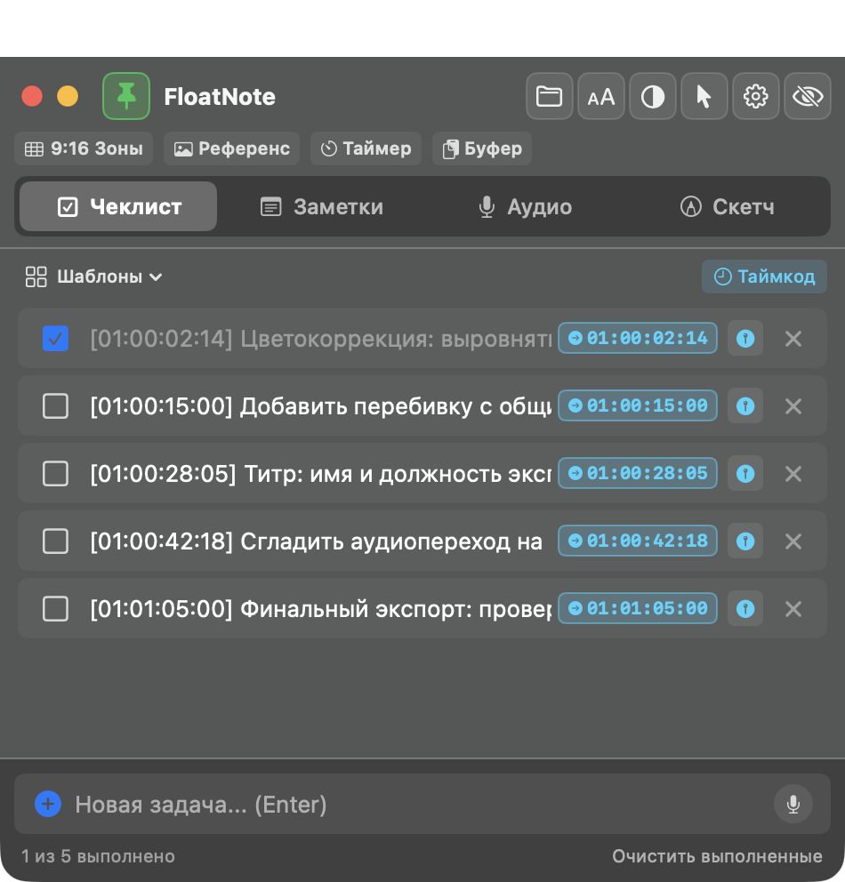
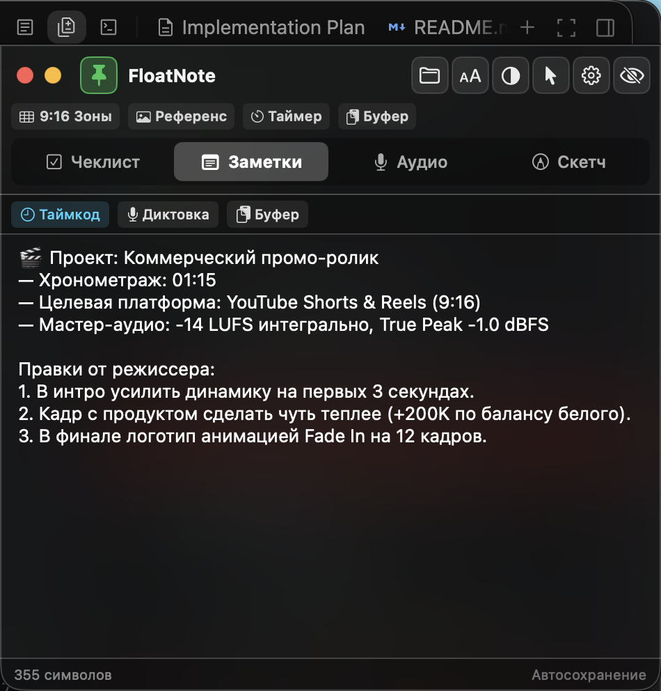
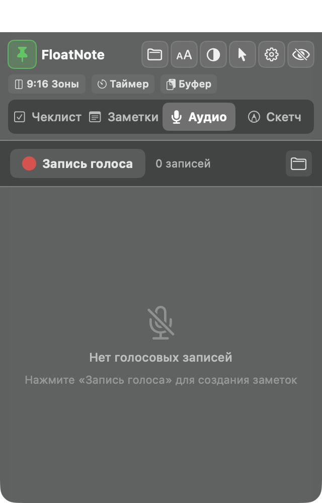
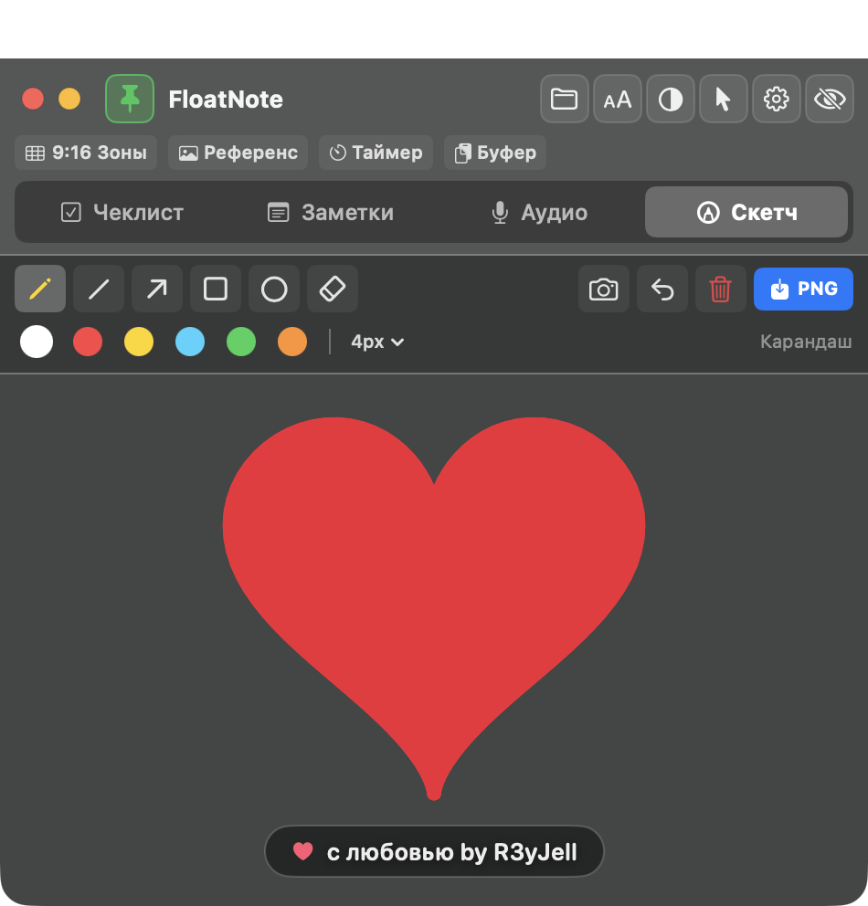
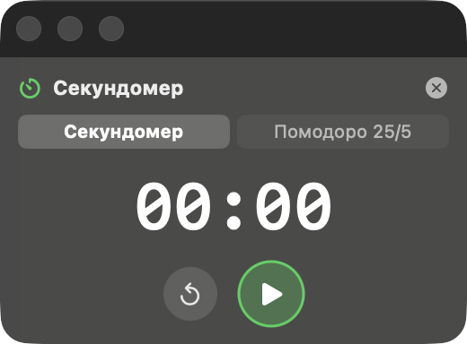
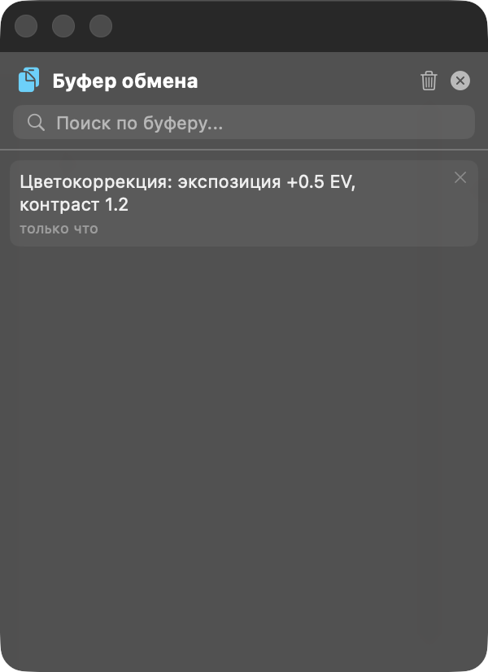
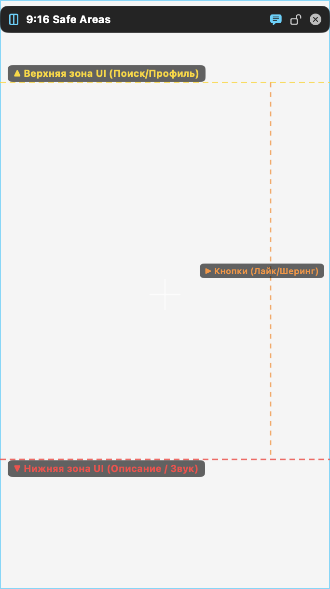
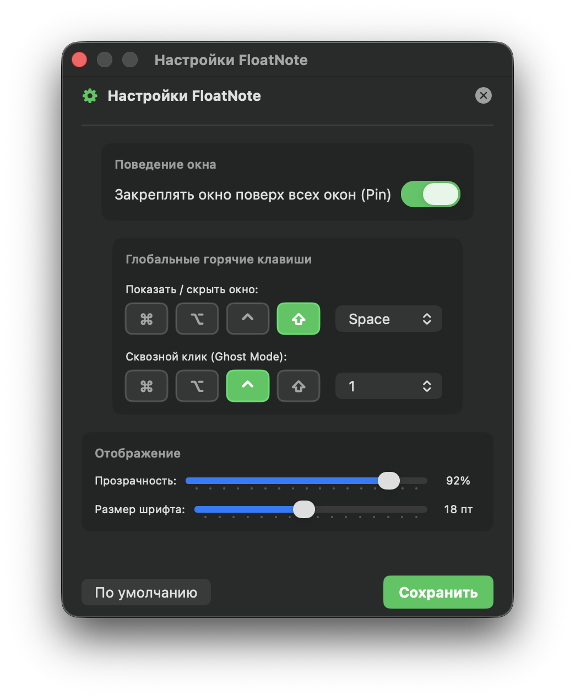

# 🎬 FloatNote — The Pro Video Editor Floating Companion

<p align="center">
  
</p>

<p align="center">
  <b>Универсальное плавающее окно-компаньон для видеомонтажеров на macOS.</b><br>
  <i>The ultimate native floating companion suite for video editors & creators on macOS.</i>
</p>

<p align="center">
  
  
  
  
  
</p>

---

[🇷🇺 Описание на русском](#-русский) | [🇬🇧 English Description](#-english)

---

## 📸 Скриншоты / Screenshots

<p align="center">
  &nbsp;&nbsp;&nbsp;&nbsp;
  
</p>
<p align="center">
  &nbsp;&nbsp;&nbsp;&nbsp;
  
</p>
<p align="center">
  &nbsp;&nbsp;&nbsp;&nbsp;
  
</p>
<p align="center">
  &nbsp;&nbsp;&nbsp;&nbsp;
  
</p>

---

## 🇷🇺 Русский

**FloatNote** — нативное, сверхлегкое приложение на SwiftUI и AppKit, созданное специально для видеомонтажеров. Оно плавает поверх любых полноэкранных NLE (DaVinci Resolve, Adobe Premiere Pro, Final Cut Pro, CapCut, Avid), не перехватывает фокус у таймлайна, мгновенно скрывается по горячей клавише и объединяет все вспомогательные инструменты монтажера в один клик.

В ядре приложения нет жестких привязок — FloatNote работает с любой монтажкой. Для пользователей **DaVinci Resolve Studio & Free** в комплекте идет официальный companion-плагин в папке `Plugins/DaVinciResolve/`.

---

### ✨ Ключевые возможности

#### 1. 🪟 Полноэкранный плавающий HUD (Level 1002)
- Висит поверх полноэкранных пространств Spaces без переключения рабочего стола (`.nonactivatingPanel`, `canJoinAllSpaces`, `fullScreenAuxiliary`).
- **First Mouse**: каждый элемент управления реагирует мгновенно с первого же клика мыши.
- **Интерактивный Pin**: скрепка для мгновенного скрытия окна (`⇧ Space` возвращает обратно).
- **Ghost Mode (`⌥ G`)**: сквозной клик сквозь окно прямо в таймлайн или плеер.

#### 2. 📋 Умный чеклист и таймкоды
- Распознавание таймкодов формата `HH:MM:SS:FF`: кликабельные бейджи `[00:01:24:00]` мгновенно копируют таймкод в буфер обмена для вставки в монтажку.
- Кнопка `⏱ Таймкод` вставляет таймкод прямо из буфера или по шаблону.
- Шаблоны монтажных задач:
  - *🎬 Предэкспортная проверка* (LUFS, offline media, титры, safe zones).
  - *🎨 Цветокоррекция* (баланс белого, skin tones, scopes).
  - *✂️ Черновой монтаж* (A-roll, отбор дублей, ритм).
  - Сохранение собственных шаблонов в JSON.

#### 3. 📝 Заметки монтажера, сценарий и мультиязычность
- Быстрые заметки, правки от режиссера или сценарий с автосохранением в реальном времени.
- **Двуязычная диктовка голосом (`🎙`)**: мгновенное переключение между русским (`RU`) и английским (`EN`) языками распознавания речи в один клик.
- **Переключатель языка интерфейса**: переключение языка приложения (RU / EN) прямо из шапки окна или в настройках.

#### 4. ⏱ Отдельное окно: Таймер монтажной смены & Помодоро
- Независимое плавающее окно:
  - **Секундомер**: учет рабочего времени над проектом.
  - **Pomodoro 25/5**: интервалы глубокого фокуса (25 мин работы / 5 мин отдыха) со звуковыми уведомлениями.

#### 5. 📋 Отдельное окно: Менеджер буфера обмена (Clipboard History)
- Независимое плавающее окно истории скопированных текстов (до 50 записей).
- Мгновенный возврат любого фрагмента в буфер для быстрой вставки в титры, генераторы текста или заметки.

#### 6. 📐 Прозрачный оверлей безопасных зон: 9:16 + 16:9 + Шпаргалка платформ
- **Плавное перетаскивание без рывков**: нативное перемещение через macOS AppKit с удобным курсором-ладонью.
- **Сверхкомпактное масштабирование**: возможность сжать сетку до минимума (`240×426` для 9:16 и `360×202` для 16:9) под любое расположение окон.
- **Режим 9:16**: разметка интерфейса Instagram Reels, TikTok, YouTube Shorts (шапка, колонка кнопок, нижнее описание).
- **Режим 16:9**: стандарты телевещания Action Safe (93%), Title Safe (80/90%), сетка правила третей (Rule of Thirds) и центральный прицел.
- **Шпаргалка платформ (Cheat Sheet)**: встроенная таблица с лимитами разрешений, FPS, битрейта и стандартов громкости (-14 LUFS для YouTube, -16 для Apple, -23 для ТВ).
- Кнопка **Lock**: оверлей блокируется и становится на 100% прозрачным для кликов мыши прямо в таймлайн.

#### 7. 🖼 Плавающее окно-референс поверх вьювера (Reference HUD)
- Отдельное плавающее окно для колористов и монтажеров.
- Перетаскивание любого кадра-референса (или вставка из буфера `⌘V`).
- Регулировка прозрачности (Opacity 10–100%) и сквозной клик (Lock) — позволяет сводить цвет кадр-в-кадр прямо поверх плеера любой монтажки.

#### 8. 🔊 Звуковые утилиты: Цензурный BEEP 1000Hz (Drag-to-Timeline)
- Встроенный нативный генератор чистого синусоидального тона 1000 Гц (-18 dBFS) длительностью 1 секунда.
- Кнопка быстрого прослушивания и кнопка получения WAV-файла для мгновенного перетаскивания на аудиодорожку в таймлайн.

#### 9. 📸 Захват кадра и скетчер (Frame Grabber & Sketch)
- Захват стоп-кадра из вьювера монтажки (`📸`) в качестве фона на холст.
- Инструменты аннотирования: стрелки, прямоугольники, круги, линии, карандаш, палитра цветов, толщина кисти.
- Экспорт эскизов с правками в PNG для отправки заказчику.

---

### 🔌 Интеграция с «Большой Тройкой» NLE: DaVinci Resolve, Premiere Pro & Final Cut Pro

FloatNote поддерживает переключение основного редактора в Настройках (`⌘,`) и адаптирует свое поведение под ваш софт:

#### ⚡ Автоматическая установка плагинов в 1 команду
```bash
./Plugins/install_all.sh
```
Скрипт автоматически найдет установленные в системе редакторы и проставит модули расширения.

---

#### 🎬 1. DaVinci Resolve (Studio & Free)
- **Live Timecode**: кнопка `⏱ Таймкод` считывает точный текущий кадр плейхеда DaVinci в реальном времени.
- **Авто-прыжок (Jump)**: клик по бирюзовому бейджу таймкода задачи мгновенно перемещает курсор в DaVinci на нужный кадр.
- **Импорт маркеров**: в верхнем меню DaVinci выберите **Workspace → Scripts → Utility → FloatNote_Bridge** — все маркеры таймлайна сразу появятся в чеклисте.

#### 🎞 2. Adobe Premiere Pro
- **Синхронизация маркеров**: запустите **File → Scripts → FloatNote_Premiere.jsx** (или через панель расширений).
- Все маркеры секвенса автоматически экспортируются в `checklist.json` и мгновенно появляются в окне FloatNote через встроенный Live File Watcher.
- **Фокус на секвенс**: при клике на таймкод FloatNote активирует Premiere Pro и копирует таймкод в буфер для мгновенной навигации.

#### 🍏 3. Apple Final Cut Pro (FCPX)
- **Умный Jump to Timecode**: при клике на таймкод задачи FloatNote активирует Final Cut Pro, нажимает системный шорткат перехода к таймкоду (`Control + P`), вставляет точный таймкод и переводит плейхед.
- **Экспорт в FCPXML 1.10**: модуль `FloatNote_FCPX` генерирует XML-события с маркерами для прямого импорта на таймлайн FCPX.

Подробнее — см. [`Plugins/DaVinciResolve/README.md`](Plugins/DaVinciResolve/README.md).

---

### ⌨️ Горячие клавиши по умолчанию

| Действие | Хоткей | Настройка |
|---|---|---|
| Скрыть / Показать окно | `⇧ Space` | Настраивается в Настройках (`⌘ ,`) |
| Сквозной режим (Ghost Mode) | `⌥ G` | Настраивается в Настройках |
| Открыть Настройки | `⌘ ,` | В окне приложения |
| Отмена действия в скетчере | `⌘ Z` | Вкладка «Скетч» |

---

### 🛠 Установка и запуск

#### Способ 1: Готовый DMG из Releases
1. Скачайте `FloatNote-1.3.dmg` со страницы [Releases](https://github.com/R3yJell89/floatnote/releases).
2. Откройте DMG и перетащите `FloatNote` в папку `Applications`.
3. ⚠️ **Если macOS пишет «Приложение повреждено» или блокирует запуск (Gatekeeper):**
   Так как приложение собрано независимым разработчиком без платного Apple Developer сертификата, macOS помечает скачанный из браузера файл атрибутом карантина. Чтобы снять его:
   - **Вариант А:** Нажмите на иконку `FloatNote.app` **правой кнопкой мыши (или Control + клик)** → выберите **«Открыть»** → нажмите кнопку **«Открыть»** в диалоге подтверждения.
   - **Вариант Б (в одну команду):** Откройте Терминал и выполните:
     ```bash
     xattr -cr /Applications/FloatNote.app
     ```
   - **Вариант В:** Откройте *Системные настройки → Конфиденциальность и безопасность* и внизу нажмите кнопку **«Подтвердить вход»** («Open Anyway»).

#### Способ 2: Сборка из исходников (Zero-Gatekeeper)
**Требования:**
- macOS 13.0+ (Ventura, Sonoma, Sequoia, Tahoe)
- Apple Silicon (M1/M2/M3/M4) или Intel Mac
- Xcode Command Line Tools (`xcode-select --install`)

```bash
git clone https://github.com/R3yJell89/floatnote.git
cd floatnote
chmod +x build.sh
./build.sh --install
```
Приложение скомпилируется прямо на вашей машине и автоматически установится в `/Applications/FloatNote.app` без каких-либо предупреждений Gatekeeper.

---

## 🇬🇧 English

**FloatNote** is a native, ultra-lightweight floating companion app crafted with SwiftUI & AppKit for professional video editors. It floats above fullscreen NLE windows (DaVinci Resolve, Adobe Premiere Pro, Final Cut Pro, CapCut, Avid), avoids stealing focus from your timeline, hides instantly with a hotkey, and bundles all essential editing companion tools into one click.

### ✨ Features
- **Fullscreen Floating HUD**: Layer `1002`, `.nonactivatingPanel`, First Mouse responsiveness.
- **Bilingual Interface & Dictation**: Quick `RU` / `EN` toggle in header and speech dictation locale switcher (`ru-RU` / `en-US`) right next to the mic.
- **Interactive Checklists & Timecodes**: Automatic `HH:MM:SS:FF` detection with click-to-copy timecode badges.
- **Workflow Templates**: Built-in checklists for Color Grading, Pre-export checks, and Rough Cut review.
- **Standalone Companion Windows**:
  - **Timer & Pomodoro**: Stopwatch and 25/5 focus timer.
  - **Clipboard History**: Up to 50 copied text snippets with 1-click restore.
- **Transparent 9:16 & 16:9 Safe Areas Overlay**: Smooth native drag with hand cursor, ultra-low minimum scaling (`240×426` / `360×202`), and built-in platform cheat sheet.
- **Frame Grabber & Sketch**: Grab viewer frames and annotate them with arrows, shapes, and persistent stroke saving without watermarks.
- **Voice Dictation**: Speech-to-text dictation via Apple Speech Framework in Russian and English.
- **DaVinci Resolve Plugin**: Dedicated companion bridge script in `Plugins/DaVinciResolve/` for timeline synchronization and marker placement.

---

### 👨‍💻 Разработчик / Developer

* **Telegram**: [@RuinaJell](https://t.me/RuinaJell)
* **GitHub**: [@R3yJell89](https://github.com/R3yJell89)

---

### 📄 Лицензия / License

MIT License. Свободно для личного и коммерческого использования.
Разработано с заботой о видеомонтажерах.
*(P.S. добавили больше багов, чтобы можно было исправить 😉)*
